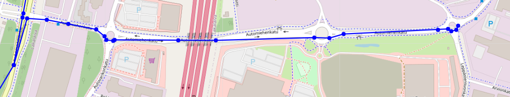

# Lokaatiotietojen generointi ja visualisointi

Tämä projekti generoi satunnaisia lokaatiotietoja katuverkostosta ja visualisoi nämä tiedot kartalla Streamlit-sovelluksen avulla. Projekti koostuu kahdesta pääskriptistä: `data.py` ja `ui.py`.

## Tiedostot

### 1. data.py

`data.py` on skripti, joka luo ja täyttää SQLite-tietokannan (lokaatiot.db) satunnaisilla lokaatiotiedoilla. Se käyttää OpenStreetMapin (OSM) katuverkostoa reittien generointiin.

#### Käytetyt kirjastot

- `sqlite3`: Tietokantatoiminnot
- `osmnx`: OpenStreetMap (OSM) -verkostojen käsittely
- `networkx`: Verkkoanalyysi
- `pandas`: Tietojen käsittely DataFrame-muodossa
- `faker`: Satunnaisen datan generointi
- `datetime`: Ajan käsittely
- `random`: Satunnaislukujen generointi

#### Käyttö

Täytä määritteet sijaintitiedoille (sijainti ja datan määrä)

```bash=
# Haetaan katuverkosto OSM:stä
place_name = "Tampere, Finland"
```
```bash=
# Määritellään parametrien arvot
rows_per_device = 1000  # Esimerkiksi 1000 riviä per laite
days_of_data = 1  # Esimerkiksi 1 päivän data
```

Generoi lokaatiodata ajamalla seuraava komento terminaalissa:

```bash
python data.py
```


Tämä luo ja täyttää lokaatiot.db-tietokannan.

### 2. ui.py

ui.py on Streamlit-sovellus, joka visualisoi lokaatiot.db-tietokannan tiedot kartalla.

#### Käytetyt kirjastot

- `sqlite3`: Tietokantatoiminnot
- `streamlit`: Web-sovellusten luominen Pythonilla
- `folium`: Karttojen luonti ja visualisointi
- `pandas`: Tietojen käsittely DataFrame-muodossa

Käyttö
Käynnistä Streamlit-sovellus ajamalla seuraava komento terminaalissa:

```bash=
streamlit run ui.py
```
Tämä avaa selaimeen (localhost) Streamlit-sovelluksen, jossa voit tarkastella lokaatiotietoja kartalla.




### 3. lokaatiot.db

lokaatiot.db on SQLite-tietokanta, joka sisältää laitteiden lokaatiotietoja. Tietokanta luodaan ja täytetään data.py-skriptin avulla.

## Asennus
Asenna tarvittavat Python-kirjastot:

```bash=
pip install sqlite3 osmnx networkx pandas faker streamlit folium
```

## Tietokannan poisto

Aja seuraava komento terminaalissa, jos haluat poistaa tietokannan. Sulje ensin Streamlit selaimesta ja terminaalista.

```bash=
python delete_data.py
```